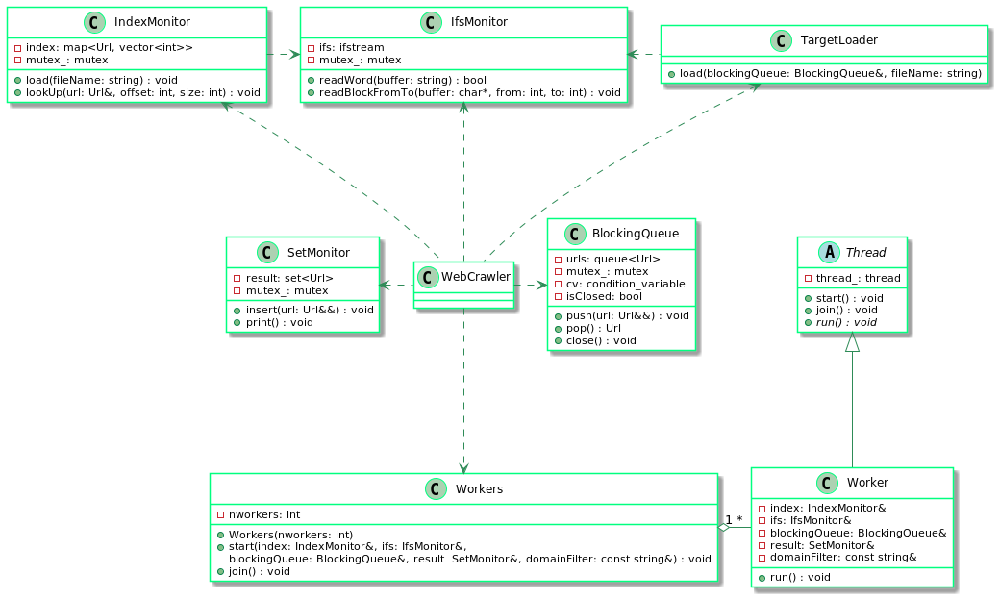
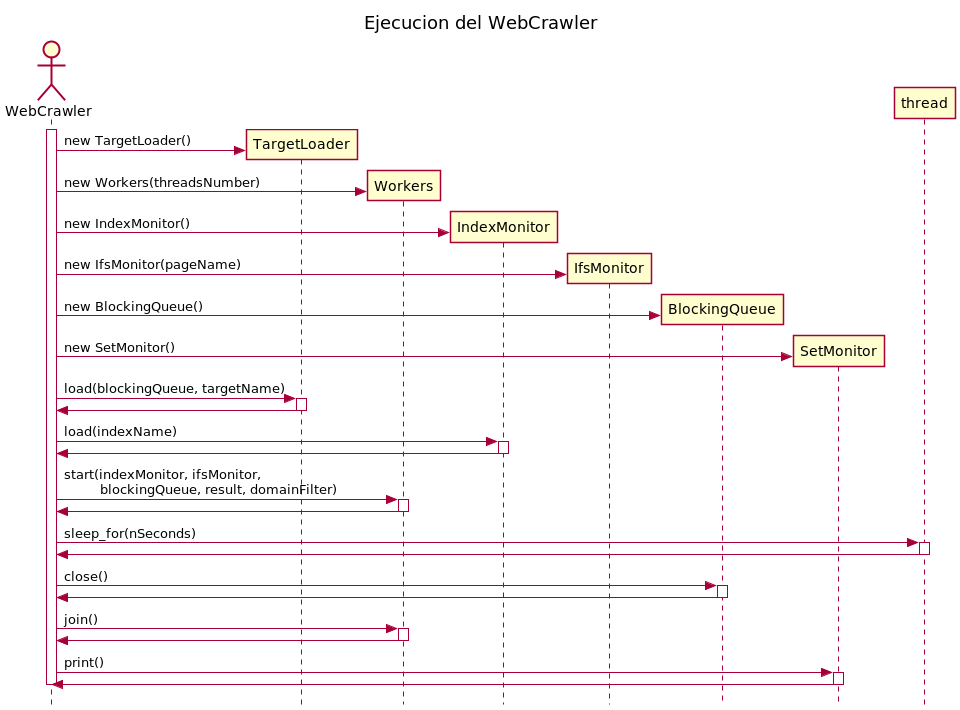
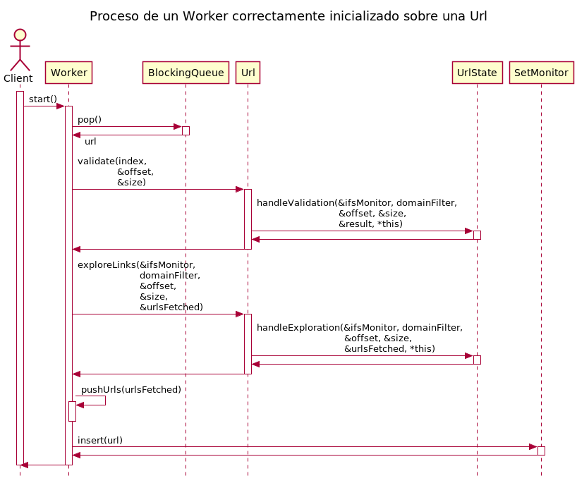
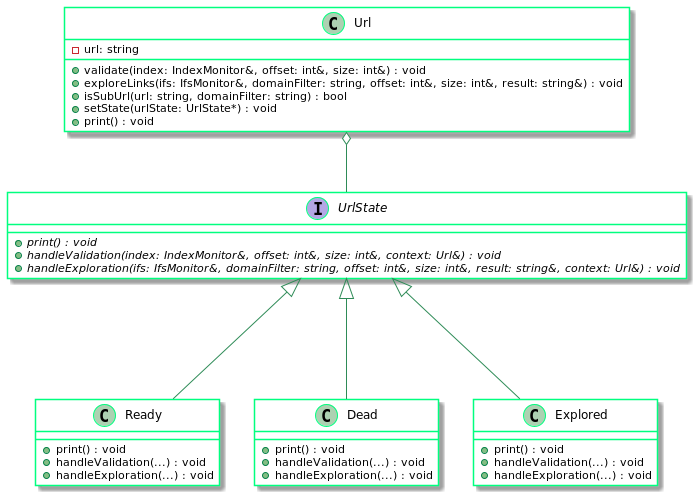

# TP2: Web Crawler #  
**Autor: Daniel Alejandro Lovera López**  
**Número padrón: 103442**  
**[https://github.com/DanieLovera/tp2](https://github.com/DanieLovera/tp2)**  
  
---
### Introducción ###  
El presente trabajo consiste en la elaboración de un Web Crawler, este es un programa que escanea un sitio web y como sus páginas se entrelazan entre si. La implementación que se realizó para el Web Crawler fue una simplificación, la busqueda sobre las páginas web fueron simuladas utilizando archivos en disco que contienen la url que se quiere explorar y, un offset y size para mapear la ubicación de su página web en un archivo html que contiene finalmente todas las páginas que serán exploradas. Con el objetivo de trabajar los conceptos aprendidos sobre hilos, la implementación además fue multithreading, para ello se trabajo con el caso base de un Worker (entidad encargada de simular el fetch de una pagina web) y posteriormente se extendió para que el programa principal haga uso de varios de estos Workers y trabajen concurrentemente.  
  
Entre las clases principales utilizadas para lograr implementar el Web Crawler multithreading se encuentran:

- **Thread**: Wrappea la clase thread de C++, con esto cualquier clase que necesite trabajar con hilos simplemente puede heradar de esta e implementar el método abstracto *```run()```*, y luego utilizar los métodos ```start()``` y ```join()``` para lanzar el hilo y sincronizarlo respectivamente.
- **Worker**: Realiza la búsqueda de la url en el IndexMonitor para verificar la validez de la url y el fetch de las urls relacionadas en el archivo html.
- **BlockingQueue**: Contenedor utilizado para guardar las urls que deben ser exploradas por el Worker, tiene un comportamiento productor debido al método ```push(Url &&url)``` y consumidor por el método ```pop()``` es decir, mientras el contenedor no sea cerrado tiene la capacidad Concurrent access to the same stream object may cause data races, except for the standard stream object cin when this is synchronized with stdio (in this case, no data races are initiated, although no guarantees are given on the order in which extracted characters are attributed to threads)de dormir todos los hilos que accedan a un pop mientras la cola este vacía y despertarlos cuando un nuevo dato fuese producido. 
- **Url**: Es una abstracción de una url.
- **IndexMonitor**: Contenedor usado para mantener las urls que son válidas para explorar.
- **IfsMonitor**: Abstracción que permite leer un archivo de entrada para proporcionarle datos al programa.  

---
### Desarrollo ###  
En esta sección se encuentran detalles de implementación del Web Crawler e hilos, además de diagramas para facilitar la comprensión al lector del trabajo realizado.  
#### Modelo del programa ####  
A continuación se presenta un diagrama que muestra como se relaciona el programa principal (Web Crawler) con otras clases para lograr su funcionamiento:  

  

Se observa como el **Web Crawler** utiliza las clases **IndexMonitor**, **IfsMontior**, **TargetLoader**, **SetMonitor**, **BlockingQueue** y **Workers**, delegando en ellas todas sus tareas, la clase *Workers* simplemente es una abstracción de N **Worker** que trabajaran concurrentemente para hacer el programa multihreading, cada *Worker* representa un thread de ejecución. Se presenta ahora un diagrama de secuencia que muestra como es la ejecución del *WebCrawler*.  

  

##### TargetLoader #####  
Esta clase solo tiene una única responsabilidad en el proceso, y es cargar en la *BlockingQueue* las urls iniciales que deben explorar los workers, estás se encuentran en un archivo de nombre \<target\>. Para lograr su objetivo usa las clase IfsMonitor sobre el archivo \<target\> y lleva los datos almacenados del disco a memoria con el método ```load(BlockingQueue &blockingQueue, std::string fileName)```.  

##### Workers #####  
Debido a que el programa puede trabajar con diversos hilos, se creó la abstraccion *Workers*. La interfaz pública es igual a la de un *Worker*, debe ser capaz de iniciar la ejecución de un hilo ```start()``` en este caso internamente se corren N hilos y de sincronizar los hilos con el thread principal ```join()```.  

##### IndexMonitor #####  
El *IndexMonitor* se encarga de cargar a memoria el contenido del archivo \<index\> que contiene las urls que son válidas para que el *Web Crawler* explore, a su vez como es el conocedor de esta información también es el que se encarga de validar todas las urls que el *Web Crawler* considere en su ejecución.  
Esta clase además es compartida entre todos los hilos de ejecución, internamente utiliza un Map para permitir una busqueda rápida por clave única, es decir que el acceso a esta estructura debe estar sincronizada para evitar data races. Los métodos implementados por la clase son:  

- **```load(const std::string &fileName)```**: Este método trabaja solo con variables locales hasta su última instrucción en donde debe insertar un valor sobre el map, y según cplusplus utilizar el operador [] para insertar valores no es seguro ("If the function inserts a new element, concurrently iterating ranges in the container is not safe."), debido a esto se decidió tomar el mutex en esta sección.  
``` 
    std::lock_guard<std::mutex> lock(mutex);
    index[std::move(url)] = std::move(mapped);
    
```  
- **```lookUp(const Url &url, std::size_t &offset, std::size_t &size) const```**: El método at de la bilbioteca std::map puede ser accedido concurrentemente de forma segura según la información provista por cplusplus ("The mapped value that is accessed may be modified by the caller. Concurrently accessing or modifying other elements is safe."). Es por esto que se decidió tomar el mutex, previo a las asignaciones del offset y el size pues son referencias a estas variables y si los hilos las llegaran a compartir, entonces la escritura debe estar sincronizada para evitar que se pisen los valores que cada hilo asigna en su ejecución.  
```
    std::lock_guard<std::mutex> lock(mutex);
    offset = mapped[0];
    size = mapped[1];
```  

##### IfsMonitor #####  
El *IfsMonitor* es de las clases mas importantes, esta wrappea a la clase std::ifstream que permite manipular la lectura de archivos en disco por lo cual es de suma importancia que el acceso a este recurso sea seguro para evitar que el puntero interno que maneja la clase para leer del archivo se vea modificado por otro hilo y las lecturas sean inconrrectas. Los métodos implementados por la clase son:  

- **```readWord(std::string &buffer)```**: Debe leer una línea del archivo y guardarla en el buffer, en este caso el operador >> no es seguro cuando no se utiliza la entrada estadar *cin* para leer datos ("Concurrent access to the same stream object may cause data races, except for the standard stream object cin when this is synchronized with stdio (in this case, no data races are initiated, although no guarantees are given on the order in which extracted characters are attributed to threads)"), por lo cual se tomó el mutex antes de esto.
``` 
    std::lock_guard<std::mutex> lock(mutex);
    return (ifs >> buffer).eof();
    
```  
- **```readBlockFromTo(char *buffer, const std::size_t from, const std::size_t to)```**: Debe leer un bloque del archivo y guardarlo  en el buffer, las instrucciones que acceden al recurso protegido utilizan métodos que no son seguros en accesos concurrentes, *seekg* ("Concurrent access to the same stream object may cause data races.") y *read* ("Concurrent access to the same stream object may cause data races, except for the standard stream object cin when this is synchronized with stdio (in this case, no data races are initiated, although no guarantees are given on the order in which extracted characters are attributed to threads)"), es por esto que se bloqueo el bloque de codigo entero.
``` 
    std::lock_guard<std::mutex> lock(mutex);
    ifs.seekg(from);
    ifs.read(buffer, to);
```

##### BlockingQueue #####  
La *BlockingQueue* fue implementada utilizando conditional variables, esto permite que tenga un comportamiento de productor y consumidor, es decir cuando no hayan mas datos que obtener mediante un ```pop()``` los hilos que solicitaron la operación se dormiran hasta que un dato vuelve a ser ingresado por un ```push()``` o se cierre la cola. Igualmente esta compartida entre hilos por lo que es thread safe. Los métodos implementados por la clase son:  

- **```push(Url &&url)```**: Carga una url en la cola, el acceso concurrente debe ser seguro, para evitar un cambio de contexto en la ejecución de un hilo antes de poder notificar a todos los hilos de la produccion de un nuevo dato.
``` 
    std::lock_guard<std::mutex> lock(mutex);
    urls.push(std::move(url));
    cv.notify_all();
```  
- **```pop()```**: Elimina una url de la cola y toma el mutex al entrar al bloque de código, no se puede tomar posterior al while pues la caracterítica del consumidor es esperar mientras no hayan datos que procesar y despertar cuando se produzca alguno.
``` 
    std::unique_lock<std::mutex> lock(mutex);
    while (urls.empty()) {
      if (isClose) throw ClosedQueueException();
      cv.wait(lock);
    }
    Url url = std::move(urls.front());
    urls.pop();
    return url;
```  
- **```close()```**: Cierra la cola para avisar que no se produciran mas datos nuevos.
``` 
	std::lock_guard<std::mutex> lock(mutex);
	isClose = true;
	cv.notify_all();
```  

##### SetMonitor #####  
El *SetMonitor* se utilizó como un contenedor común en donde todos hilos inserten las urls que vayan explorando, debido a que se comparten entre hilos se deben proteger los métodos que puedan producir data races, el contenedor en este caso además tiene la particularidad de no aceptar duplicados y guardarlos de forma ordenada. En este caso solo se deben cuidar dos métodos:  

- **```insert(Url &&url)```**: Inserta una nueva url en la colección.
``` 
    std::lock_guard<std::mutex> lock(mutex);
    result.insert(std::move(url));
``` 
- **```print()```**: Muestra la colección.
``` 
    std::lock_guard<std::mutex> lock(mutex);
    for (const Url &url : result) {
      url.print();
    }
```  
##### Worker #####  
Esta clase representa a un Web Crawler de un único hilo, hereda de la clase Thread e implementa el método ```run()```, en donde realiza el trabajo de busqueda en el \<index\> y busqueda de urls en el \<pages\> delegando sobre las clases url y set. A continuación se presenta un diagrama con el funcionamiento de la clase.  

  

##### Url #####  
Esta es probablemente la clase mas importante para resolver el trabajo del Web Crawler, internamente implementa los estados correspondientes para cada url utilizando un patron state modificado para recibir un contexto via handlers en lugar de atributo, debido a que los estados no pueden mantener una referencia a su contexto mientras este contexto sea instanciado en el stack, promoviendo así el uso del stack. En el siguiente diagrama de clases se muestra como esta constituida una url y sus estados.  

  

### Conclusiones ###  


